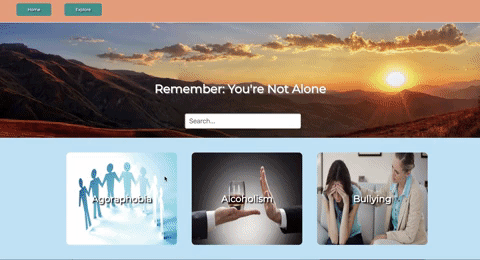

# NotAlone
[Live Demo!](https://ui.acridly34.hasura-app.io/#/)

NotAlone is a novel approach in improving mental health through the use of web-based group therapy. Therapy is an incredibly useful tool that helps with a range of issues, and NotAlone seeks to bring anonymous group therapy treatment to people wherever they are.

## Features
+ User Auth powered by Hasura
+ Live video conferencing powered by TokBox

## Group Therapy Rooms  
Users can browse therapy groups by topic and join rooms for live human interaction. Rooms persist on the app and have regular meet times for members. Membership is determined room moderators and groups are free to form and disband as desired.

## Technologies
NotAlone is built with Node.js, Express, Postgres through Hasura, and React.

React was chosen to implement reusable, composable, and stateful components. By storing  data in react components NotAlone was able to quickly and reliably add functionality for users in discrete, easy to understand blocks of code.

Node.js and Express were selected to be used with React in order to keep everything in one language. In addition, Node's extensive packages library allows for rapid project development and deployment.

NotAlone's backend is built with Hasura on a Postgres database. Database management, Models, Association, and User Auth are all handled using the Hasura platform. Hasura was selected for this project because it boasts an incredibly rapid speed of deployment and it is development language agnostic.

NotAlone's video conferencing is provided by OpenTok. The OpenTok platform was selected because of its flexibility and the ease with which it can be integrated into a web platform.

## Future Features
+ User merit badges system to motivate users to continue to attend therapy sessions
+ Moderator rating to help users to provide feedback and rate group moderators
+ Topic Search to allow users to more quickly browse topics of interest
+ Allowing users create special interest rooms.
+ Resources and Provisions for users who need professional help beyond what NotAlone can offer.
+ Calendars and reminders to remind users when to make their appointments.
+ In app messaging.
+ Opt in user face/voice obscurement. Asking for help can be scary. Allowing users the option for full anonymity can bring group therapy even to people who don't want to show their face.
